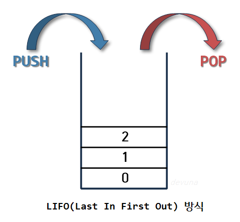

# 스택(STACK)과 큐(QUEUE)의 개념 및 차이점
## 스택(STACK)이란?
### 📌 개념

스택(STACK)이란 쌓아 올린다는 것을 의미하며 책을 쌓는 것처럼 차곡차곡 쌓아 올린 형태의 자료구조를 말한다.

 

### 📌 특징
- 스택은 위의 사진처럼 같은 구조와 크기의 자료를 정해진 방향으로만 쌓을 수 있고 Top으로 정한 곳을 통해서만 접근할 수 있다.
- Top은 가장 최근에 들어온 자료(가장 위에 있는 자료)를 가르키며, 새로 삽입되는 자료는 Top이 가르키는 자료 위에 쌓이게 된다.
- 스택에서 자료를 삭제할 때도 Top이 가르키는 자료먼저 삭제가 가능하다.
- 스택에서 Top에 삽입하는 연산을 `'push'`, 삭제하는 연산을 `'pop'`라고 한다.

따라서 스택은 시간 순서에 따라 자료가 쌓이며, 가장 마지막에 삽입된 자료가 가장 먼저 삭제되는 구조적 특징을 가지고 있다. 이러한 스택(STACK)을 후입선출(LIFO, Last-In-First-Out)구조라고 한다. 
(비어있는 스택에서 원소를 추출하려고 할때 stack underflow라고 하며, 스택이 넘치는 경우 stack overflow라고 한다.)

 

### 📌 스택의 활용 예시
스택의 특징인 후입선출(LIFO)을 활용하여 여러 분야에서 활용이 가능하다.
- `웹 브라우저 방문기록(뒤로 가기)`: 가장 나중에 열린 페이지부터 다시 보여준다.
- `역순 문자열 만들기` : 가장 나중에 입력된 문자부터 출력한다.
- `실행 취소(undo)` : 가장 나중에 실행된 것부터 실행을 취소한다.
- `수식의 괄호 검사` : 연산자 우선순위 표현을 위한 괄호 검사

 

## 큐(QUEUE)이란?
### 📌 개념

큐(QUEUE)의 사전적 의미는`(무엇을 기다리는 사람, 자동차 등의)줄, 혹은 줄을 서서 기다리는 것`을 의미한다. 따라서 놀이동산에서 줄을 서서 기다리는 것, 은행에서 먼저 온 사람의 업무를 창구에서 처리하는 것과 같이 먼저 지정된 것을 먼저 처리하는 것이 큐라는 자료구조인 것이다.

 

### 📌 특징
정해진 한 곳을 통해 삽입, 삭제가 이루어지며 `스택`과 달리 한쪽 끝에서 삽입 작업, 다른 한쪽 끝에서 삭제 작업이 양쪽으로 이루어진다.

이때 삭제 연산만 수행되는 곳을 프론트(Front), 삽입연산만 이루어지는 곳을 리어(rear)로 정하여 각각 연산작업만 수행된다. 이때 `리어`에서 이루어지는 삽입연산을 `인큐(enQueue)`, `프로트`에서 이루어지는 삭제연산을 `디큐(deQueue)`라고 부른다.

- 큐의 가장 첫 원소를 front / 가장 끝 원소를 rear
- 큐는 들어올 때 rear로 들어오지만 나올때는 front부터 빠지는 특성
- 접근방법은 가장 첫 원소와 끝 원소로만 가능
- 가장 먼저 들어온 프론트 원소가 가장 먼저 삭제

즉, 큐에서 프론트 원소는 가장 먼저 큐에 들어왔던 첫 번째 원소가 되는 것이며, 리어 원소는 가장 늦게 큐에 들어온 마지막 원소가 되는 것이다.

 

### 📌 큐의 활용 예시
큐는 주로 데이터가 입력된 시간 순서대로 처리해야 할 필요가 있는 상황에 이용한다.
- `우선순위가 같은 작업 예약`(프린터의 인쇄 대기열)
- 은행 업무
- `콜센터 고객 대기시간`
- `프로세스 관리`
- `너비 우선 탐색(BFS, Breadth-First Search)구현`
- 캐시(Cache)구현