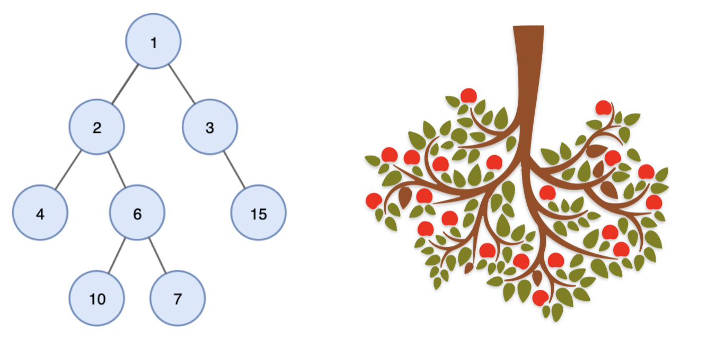
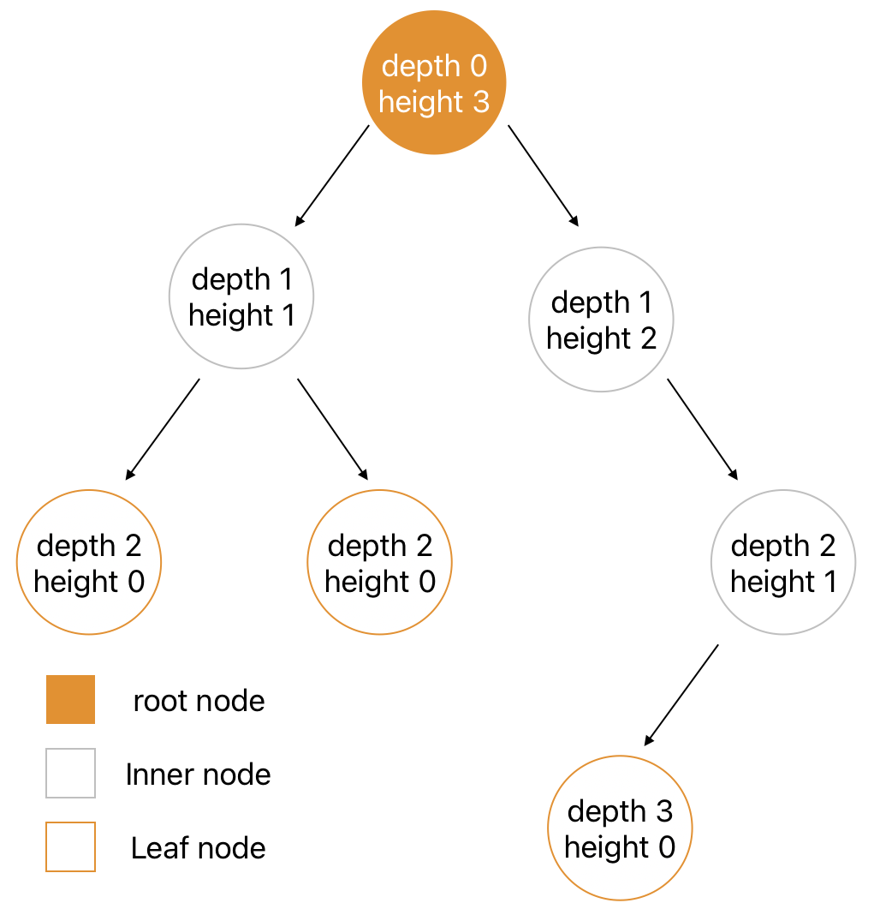
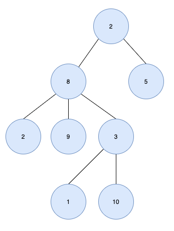
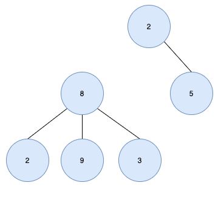
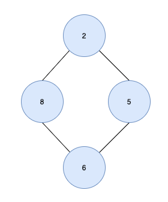
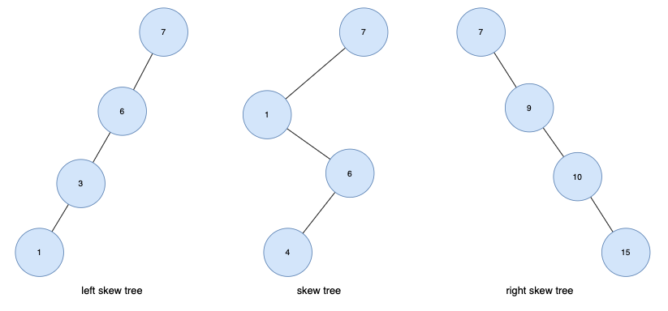

# 트리(Tree)
트리(Tree)란 노드들이 나무 가지처럼 연결된 `비선형 계층적 자료구조`이다.

트리는 아래와 같이 나무를 거꾸로 뒤집어 놓은 모양과 유사하다.

트리는 또한 트리 내에 다른 하위 트리가 있고 그 하위 트리 안에는 또 다른 하위 트리가 있는 `재귀적 자료구조`이기도 하다.

컴퓨터의 diretory구조가 트리 구조의 대표적인 예이다.

 

## 트리 구조에서 사용되는 기본 용어

***1. 노드(Node)***
- 트리를 구성하고 있는 기본 요소
- 노드에는 키 또는 값과 하위 노드에 대한 `포인터(pre or next)`를 가지고 있음 
- A, B, C, D, E, F, G, H, I, J

***2. 간선(Edge)***
- 노드와 노드 간의 연결선

***3. 루트 노드(Root Node)***
- 트리 구조에서 `부모가 없는` 최상위 노드
- root node : A

***4. 부모 노드(Parent Node)***
- 자식 노드를 가진 노드
- H, I에 부모 노드는 D이다.

***5. 자식 노드(Child Nod)***
- 부모 노드의 하위 노드
- 노드 D의 자식 노드는 H, I

***6. 형제 노드(Sibling node)***
- 같은 부모를 가지는 노드
- H, I는 같은 부모를 가지는 형제 노드 이다.

***7. 외부 노드(external node, outer node), 단말 노드(terminal node), 리프 노드(leaf node)***
- 자식 노드가 없는 노드
- H, I, J, F, G

***8. 내부 노드(internal node, inner node), 비 단말 노드(non-terminal node), 가지 노드(branch node)***
- 자식 노드 하나 이상 가진 노드
- A, B, C, D, E

***9. 깊이(depth)***
- 루트에서 어떤 노드까지의 간선(Edge)수
- 루트 노드의 깊이 : 0
- D의 깊이 : 2

***10. 높이(height)***
- 어떤 노드에서 리프 노드 까지 가장 긴 경로의 간선(Edge) 수
- 리프 노드의 높이 : 0
- A 노드의 높이 : 3

***1. Level***
- 루트에서 어떤 노드까지의 간선(Edge) 수

***2. Degree***
- 노드의 자식 수
- Leaf node의 degree : 0, A의 degree : 2

***3. Path***
- 한 노드에서 다른 한 노드에 이르는 길 사이에 놓여있는 노드들의 순서
- A & H경로 : A-B-D-H

***4. Path Length***
- 해당 경로에 있는 총노드의 수
- A & H경로 길이 : 4

***5. Size***
- 자신을 포함한 자손의 노드 수
- 노드 B의 size : 6

***6. Width***
- 레벨에 있는 노드 수
- Level 2 width : 4

***7. Breadth***
- 리프 노드의 수
- Breadth : 5

***8. Distance***
- 두 노드 사이의 최단 경로에 있는 간선(Edge)의 수
- D와 J의 Distance : 3

***9. Order***
- 부모 노드가 가질 수 있느 최대 자식의 수
- Order3 : 부모 노드는 최대 3명의 자식을 가질 수 있다.

 

## 특징
트리는 아래와 같은 특징을 가지고 있다.
- `하나의 루트 노드와 0개 이상의 하위 트리`로 구성되어 있다.
- 데이터를 순차적으로 저장하지 않기 때문에 `비선형 자료구조`이다.
- 트리내에 또 다른 트리가 있는 `재귀적 자료구조`이다.
- 단순 순환(Loop)을 갖지 않고, 연결된 `무방향 그래프 구조`이다.
- 노드 간에 부모 자식 관계를 갖고 있는 계층형 자료구조이며 `모든 자식 노드는 하나의 부모 노드`만 갖는다.
- 노드가 n개인 트리는 항상 n-1개의 간선(edge)을 가진다.

다음은 트리가 아닌 경우이다.

루트 노드가 2개(2, 8)있으므로 트리가 아니다.

노드6에는 2명의 부모 노드(8, 5)가 있고 사이클(2-8-6-5)이 형성되므로 트리가 아니다.

 

## 트리 종류
### 편향 트리 (skew tree)
- 모든 노드들이 자식을 하나만 가진 트리
- 왼쪽 방향으로 자식을 하나씩만 가질 때 `left skew tree`, 오른쪽 방향으로 하나씩만 가질 때 `right skew tree`라고한다.

 

### 이진트리 (Binary Tree)
- 각 노드의 `차수(자식 노드)가 2이하인 트리`

 

### 이진 탐색 트리 (Binary Search Tree, BST)
- `순서화`된 이진 트리
- 노드의 `왼쪽 자식`은 부모의 값보다 `작은 값`을 가져야 하며 노드의 `오른쪽은 자식`은 부모의 값보다 `큰 값`을 가져야함.

 

### m원 탐색 트리 (m-way search tree)
- 최대 m개의 서브 트리를 갖는 탐색 트리
- 이진 탐색 트리의 확장된 형태로 `높이를 줄이기 위해 사용`

 

### 균형 트리 (Balanced Tree, B-Tree)
- m원 탐색 트리에서 높이 균형을 유지하는 트리
- height-balanced m-way tree라고도 함

 

## 사용 사례
### 계층적 데이터 저장
- 트리는 데이터를 계층 구조로 저장하는 데 사용된다.
- 예를 들어 파일 및 폴더는 계층적 트리 형태로 저장된다.

  

### 효율적인 검색 속도
- 효율적인 삽입, 삭제 및 검색을 위해 트리 구조를 사용한다.

 

### 힙
- 힙도 트리로 된 자료구조이다.

 

### 데이터 베이스 인데싱
- 데이터베이스 인덱싱을 구현하는데 트리를 사용한다.
- 예) B-Tree, B+Tree, AVL-Tree...

 

### Trie
- 사전을 저장하는 데 사용되는 특별한 종류의 트리이다.

