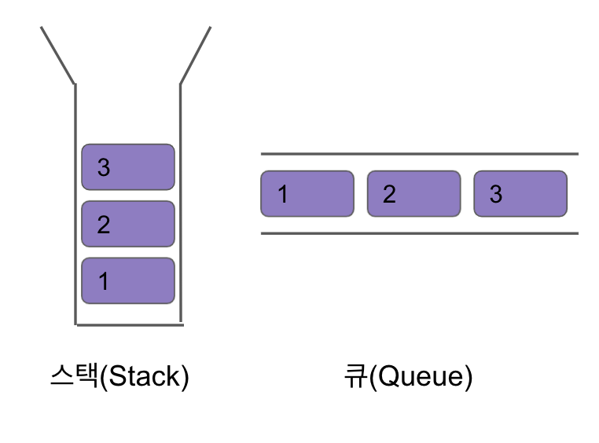

# 스택(Stack), 큐(Queue) in 파이썬
## 스택 & 큐
> - 스택, 큐 모두 '선형'자료구조이다.
> - 추가적으로 대표적인 비선형 자료구조에는 '트리','그래프'가 있다.



## 스택(Stack)
- `후입선출(LIFO, Last-In, First-Out)`구조로 가장 나중에 추가된 자료가 가장 먼저 제거된다.
- 제한적으로 접근 가능한 자료구조이다.
- 스택은 의존관계가 있는 상태를 처리한다.
- 만약 어떤 일보다 더 먼저 처리되어야 하는 일이 있다면 스택에 저장할 수 있다.

### 스택이 활용되는 예시
> 1. 콜스택<br>
> 컴퓨터 프로그램에서 현재 실행중인 함수(서브루틴)을 저장하는 역할을 한다.<br>
> `-> 실행 중인 서브루틴은 호출되어 그 실행이 아직 완료되지는 않았지만, 완류 후에는 호출된 지점으로 제어를 넘겨야한다.`

> 2. 재귀함수<br>
> 재귀적으로 함수를 호출해야 하는 경우 임시 데이터를 스택에 넣고, 재귀함수를 빠져나와 되각 검색을 할 경우 스택에 넣어 두었던 임시 데이터를 뺀다.<br>
> `-> 스택은 이러한 재귀 알고리즘을 반복적 형태로 구현할 수 있도록 만들어 준다.`

### 스택이 지원하는 연산 목록
- push : 스택에 값을 넣는 연산
- pop : 스택에서 자료를 빼는 연산
- top : 스택의 가장 위에 있는 자료를 반환하는 연산
- empty : 스택이 비어있는지의 여부를 반환하는 연산
`-> 파이썬의 append, pop 연산으로 리스트를 통해 구현할 수 있다.

### 스택 구현하기
스택은 아래의 두 가지 방법으로 구현이 가능하다.
> - 배열을 이용해 구현하기<br>
>   -> 배열은 데이터 양이 많지만 삽입/삭제가 거의 없고, 데이터의 접근이 빈번히 이뤄질 때 유리하다.
> - 연결리스트를 이용해 구현하기
>   -> 연결리스트는 삽입/삭제가 빈번히 이뤄지고, 데이터의 접근이 거의 없을 때 유리하다.

<br>

***배열로 구현***
```python
# 배열로 구현
class Stack:
    def __init__(self):
        self.stack = []

    # 출력
    def __str__(self):
        return str(self.stack)

    # 데이터 삽입
    def push(self, data):
        self.stack.append(data)

    # 유뮤 확인
    def isEmpty(self):
        if len(self.stack) == 0:
            return True
        else:
            return False
    
    # 데이터 제외
    def pop(self):
        if self.isEmpty():
            return 'Stack is empty'
        else:
            return self.stack.pop()
        
    # stack top 확인
    def top(self):
        if self.isEmpty():
            return 'Stack is empty'
        else:
            return self.stack[-1]
    

stack = Stack()
print(f'stack.isEmpty() : {stack.isEmpty()}')
stack.push(1)
stack.push(2)
stack.push(3)
print(f'stack : {stack}')
print(f'stack.isEmpty() : {stack.isEmpty()}')
print(f'stack.pop() : {stack.pop()}')
print(f'stack.top() : {stack.top()}')
print(f'stack.pop() : {stack.pop()}')
print(f'stack.top() : {stack.top()}')
print(f'stack : {stack}')

'''
stack.isEmpty() : True
stack : [1, 2, 3]
stack.isEmpty() : False
stack.pop() : 3
stack.top() : 2
stack.pop() : 2
stack.top() : 1
stack : [1]
'''
```

***연결리스트로 구현***
```python
# 연결리스트로 구현
# Singly Linked Stack

# Node
class Node:
    def __init__(self, data) -> None:
        self.data = data
        self.next = None

# 단일 연결 스택
class SinglyLinkedStack:
    def __init__(self) -> None:
        self.head = None

    def __str__(self):
        if not self.isEmpty():
            current = self.head
            string = ''

            while current:
                string += str(current.data)
                if current.next:
                    string += '->'
                if current.next == self.head:
                    string += '->' + string
                    break
                current = current.next
            return string 

    def isEmpty(self):
        if self.head is None:
            return True
        else:
            return False
    
    def pop(self):
        if self.isEmpty():
            return 'Stack is Empty'
        else:
            popped = self.head.data
            self.head = self.head.next
            return popped
        
    def push(self, data):
        new_node = Node(data)

        # push된 데이터는 head를 가리킨다.
        new_node.next = self.head

        # head는 top 데이터가 된다.
        self.head = new_node

    def top(self):
        if self.isEmpty():
            return 'Stack is Empty'
        else:
            return self.head.data
        
sls = SinglyLinkedStack()
print(f'sls.isEmpty() : {sls.isEmpty()}')
sls.push(1)
print(f'sls.isEmpty() : {sls.isEmpty()}')
print(f'sls.top() : {sls.top()}')
sls.push(2)
print(f'sls.top() : {sls.top()}')
print(f'sls : {sls}')
print(f'sls.pop() : {sls.pop()}')
print(f'sls : {sls}')


'''
sls.isEmpty() : True
sls.isEmpty() : False
sls.top() : 1
sls.top() : 2
sls : 2->1
sls.pop() : 2
sls : 1
'''
```

<br>

## 큐(Queue)
- `선입선출(FIFO, First-In First-Out)`구조로 가장 처음에 추가된 자료가 가장 먼저 제거된다.
- 입구와 출구가 각각 `반대쪽 끝에` 존재하는 자료구조이다.

<br>

### 큐가 활용되는 예시
> 1. 스케줄링<br>
> 운영체제가 프로세스를 관리하는 기법을 의미한다.
> -> 동시에 실행되는 여러 프로세스에 CPU 드으이 자원 배정을 적절히 해 성능을 개선하는 기법이다.

> 여러 프로세스를 동시에 수행할 수 있게 하기 위한 기법인 시분할 시스템을 비롯해 스케줄링 알고리즘은 매우 다양하지만, 대체로 '큐'를 기반으로 스케줄링을 관리한다.
> -> 만약 어떤 작업이 병렬적으로 이루어져도 괜찬을 때, 작업들 사이에 의존관계가 없다면 큐에 저장해서 관리한다.

<br>

### 큐가 지원하는 연산 목록
- push : 큐에 값을 넣는 연산 
- pop : 큐에서 자료를 빼는 연산
- front : 큐의 가장 앞에 있는 자료를 반환하는 연산
- back : 큐의 가장 뒤에 있는 자료를 반환하는 연산
- empty : 큐가 비어있는지의 여부를 반환하는 연산

<br>

### 📌 큐의 연산 더 알아보기
1. 큐의 포인터
- head : 큐의 첫 번째 원소를 가리키는 포인터
- rear : 큐의 마지막 원소를 가리키는 포인터
2. 큐에 삽입, 삭제하기
- push : rear위치에 자료를 추가하고 rear를 1증가시킴
- pop : head위치의 자료를 제거하고 head를 1증가시킴

만약 rear이 가리키는 인덱스가 배열의 크기를 초과하게 되면 문제가 생기는데, 이를 해결하기 위한 것이 `원현 큐``링크드 큐`이다.

<br>

### 큐의 종류
> 1. 원형 큐<br>
> 원형 큐의 경우, rear이나 head가 큐의 끝에 도달하면 이를 큐의 맨 앞으로 보내 문제를 해결한다.

> 2. 링크드 큐<br>
> - 연결리스트로 구현한 큐를 의미한다.
> - 삽입과 삭제가 제한되지 않으며 크기의 제한이 없다.

<br>

### 큐 구현하기
아래의 세가지 메소드를 활용해 큐를 구현한다.
- enqueue : 데이터를 삽입하는 과정을 의미한다.
- dequeue : 데이터를 꺼내는 과정을 의미함
- peek : front에 있는 값을 꺼내지 않고 어떤 값인지만 return함

<br>

***배열로 구현***
```python
# 배열로 구현
class Queue:
    def __init__(self) -> None:
        self.queue = []

    # 출력
    def __str__(self):
        if self.isEmpty():
            return 'Queue is Empty'
        else:
            return str(self.queue)

    # 유무 확인
    def isEmpty(self):
        if not self.queue:
            return True
        else:
            return False
        
    # 추가
    def enqueue(self, data):
        self.queue.append(data)

    # 제거
    def dequeue(self):
        if self.isEmpty():
            return 'Queue is Emtpy'
        else:
            dequeued = self.queue[0]
            # 꺼낸 뒤 나머지 재정비
            self.queue = self.queue[1:]
            return  dequeued

    # front가 무엇인지 보여준다.
    def peek(self):
        if self.isEmpty():
            return 'Queue is Empty'
        else:
            peeked = self.queue[0]
            return peeked

queue = Queue()
print(f'queue.isEmpty() : {queue.isEmpty()}')

queue.enqueue(1)
print(f'queue.isEmpty() : {queue.isEmpty()}')


queue.enqueue(2)
queue.enqueue(3)
print(f'queue : {queue}')
print(f'peek : {queue.peek()}')
print(f'queue.dequeue() : {queue.dequeue()}')
print(f'queue : {queue}')
print(f'peek : {queue.peek()}')

'''
queue.isEmpty() : True
queue.isEmpty() : False
queue : [1, 2, 3]
peek : 1
queue.dequeue() : 1
queue : [2, 3]
peek : 2 
'''
```
***연결리스트로 구현***
```python
# 연결리스트로 구현
class Node:
    def __init__(self, data):
        self.data = data
        self.next = None

class LinkedListQueue:
    def __init__(self):
        self.front = None
        self.rear = None
    
    # 출력
    def __str__(self):
        current = self.front
        rear = self.rear
        string = ''
        while current:
            string += str(current.data)
            if current.next:
                string += '->'
            if current.next == self.front:
                string += '->' + string
                break
            current = current.next
        return string

    # 유무 확인
    def isEmpty(self):
        if self.front is None:
            return True
        else:
            return False
    
    # 추가
    def enqueue(self, data):
        new_node = Node(data)

        if self.isEmpty():
            self.front = new_node
            self.rear = new_node
        else:
            self.rear.next = new_node
            self.rear = new_node

    # 제거
    def dequeue(self):
        if self.isEmpty():
            return 'Queue is Empty'
        else:
            dequeued = self.front
            self.front = self.front.next
        
        # front가 None이 되면 큐가 비었다는 뜻이므로 rear도 None로 변경
        if self.front is None:
            self.rear = None
    
    # 앞의 front 데이터 확인
    def peek(self):
        if self.isEmpty():
            return 'Queue is Empty'
        else:
            return self.front.data
        

llq = LinkedListQueue()
print(f'llq.isEmpty() : {llq.isEmpty()}')

llq.enqueue(1)
print(f'llq.isEmpty() : {llq.isEmpty()}')
llq.enqueue(2)
llq.enqueue(3)
print(f'llq : {llq}')
print(f'llq.peek() : {llq.peek()}')
llq.dequeue()
print(f'llq : {llq}')
print(f'llq.peek() : {llq.peek()}')

'''
llq.isEmpty() : True
llq.isEmpty() : False
llq : 1->2->3
llq.peek() : 1
llq : 2->3
llq.peek() : 2
'''
```