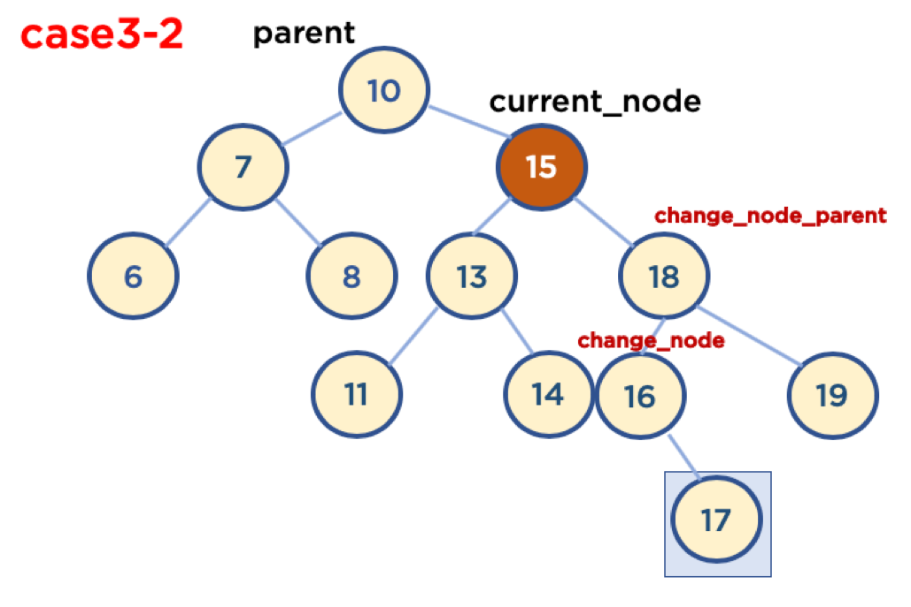

# 이진 탐색 트리(Binary Search Tree) in 파이썬
이전 자료구조 학습에서 트리(Tree)구조가 어떠한지 알아보았다.

기본적으로 트리(Tree)는 Node와 Edge를 이용해서 사이클을 이루지 않도록 구성한 데이터 구조이다.

트리의 종류는 편향트리(skew tree), 이진트리(Binary Tree), 이진 탐색 트리(Binary Search Tree), m원 탐색 트리(m-way Search Tree), 균형 트리(Balanced Tree) 등이 있는데 이 중 `이진 트리(Binary Tree)형태의 구조`로, `탐색 알고리즘 구현`을 위해 많이 사용된다.

트리에 대한 상세한 내용은 아래 블로그에 설명해 놓았다.

[트리(Tree)](https://github.com/laagom/Tech-Knowledge/blob/main/Computer%20Science/Data%20Structure/%ED%8A%B8%EB%A6%AC(Tree).md)

<br>

## 이진 트리와 이진 탐색 트리
1. 이진 트리 : 노드의 최대 Edge(간선)이 2인 트리구조이다.
2. 이진 탐색 트리(Binary Search Tree, BST) : 이진 트리에 다음과 같은 추가적인 조건이 걸려있는 트리구조이다.


[출처 : www.mathwarehouse.com](https://blog.penjee.com/5-gifs-to-understand-binary-search-tree/#binary-search-tree-insertion-node)

위에서 예시와 같이 `왼쪽 노드는 해당 노드보다 작은 값, 오른쪽 노드는 해당 노드보다 큰 값`을 가지고 있다.

<br>

## 자료 구조 이진 탐색 트리의 용도와 장점
1. 용도 : `데이터 검색(탐색)`
2. 장점 : 탐색 속도를 개선할 수 있음

<br>

### 이진트리와 정렬된 배열간의 탐색 비교


[출처 : www.mathwarehouse.com](https://blog.penjee.com/5-gifs-to-understand-binary-search-tree/#binary-search-tree-insertion-node)

위와 같이 `27`의 값을 찾기위해 이진트리는 3번의 탐색을 거치면 마무리가 되고 정렬된 배열에서는 순차적으로 탐색을 해야하기 때문에 모든 원소를 확인해야해서 탐색의 횟수가 많은 것을 알 수 있다.

<br>

## 파이썬을 이용한 구현

### 노드 클래스
```python
# 노드
class Node:
    def __init__(self, data):
        self.data = data
        self.left, self.right = None, None
```

### 이진 탐색 트리 데이터 입력
이진 탐색 트리 조건에 부합하게 데이터를 넣어야 한다.
```python
# 이진 탐색 트리
class BinarySearchTree:
    def __init__(self, head):
        self.head = head

    def insert(self, data):
        self.current_node = self.head
        while True:
            if data < self.current_node.data:
                if self.current_node.left != None:
                    self.current_node = self.current_node.left
                else:
                    self.current_node.left = Node(data)
                    break
            else:
                if self.current_node.right != None:
                    self.current_node = self.current_node.right
                else:
                    self.current_node.right = Node(data)
                    break
```

```python
binary_search_tree = BinarySearchTree(Node(1))
binary_search_tree.insert(2)
binary_search_tree.insert(0)
binary_search_tree.insert(4)
binary_search_tree.insert(8)
binary_search_tree.insert(-2)

binary_search_tree.search(8)

'''
True
'''
```

<br>

### 데이터 삭제
이진 탐색 트리의 삭제 로직은 복잡하기 때문에 3가지 경우로 나눠서 구현해 보겠다.

### Leaf Noded인 경우
- Leaf Node : 자식노드가 하나도 존재하지 않는 노드
- `삭제할 노드를 부모와의 연결을 끊는다.`


### 자식이 하나인 Branch Node인 경우
- Branch Node : 자식노드를 하나 이상 가진 노드
- `삭제할 노드를 부모와 연결을 끊고, 삭제할 노드의 자식 노드를 부모와 연결한다.`


### 자식이 두개인 Branch Node인 경우
이 경우는 아래와 같이 2가지 전략이 존재한다.
- 삭제할 Node의 오른쪽 자식 중, `가장 작은 값`을 삭제할 Node의 부모 노드와 연결한다.
- 삭제할 Node의 왼쪽 자식 중, `가장 큰 값`을 삭제할 Node의 부모 노드와 연결한다.


### 삭제할 Node 탐색
삭제할 Node가 없는 경우에는 `False`를 리턴하여 함수를 종료할 수 있게 처리한다.
```python
    def delete(self, data):
        searched = False
        self.current_node, self.parent = self.head, self.head

        # 이진 탐색 트리를 탐색
        while self.current_node:
            # 인자로 전달받은 값과 현재노드 값이 동일
            # 아래에서 Node가 존재하지 않는 경우의 분기에 걸리지 않음
            if self.current_node.data == data:
                searched = True
                break
            # 삭제하려는 노드가 가르키고 있는 노드보다 크고 작은지 확인
            # 삭제하려는 노드가 확인 될 때까지 계속 탐색
            elif data < self.current_node.data:
                self.parent = self.current_node
                self.current_node = self.current_node.left
            else:
                self.parent = self.current_node
                self.current_node = self.current_node.right
                
        # 위에서 탐색 후 삭제할 Node가 존재하지 않는 경우
        if searched == False:
            return searched
```

<br>

### Case 1 : 삭제할 Node가 Leaf Node인 경우


```python
        # case 1 : 자식 노드가 존재하지 않는 Leaf Node인 경우
        if (self.current_node.left == None) and (self.current_node.right == None):
            # 삭제하려는 값이 부모 노드의 왼쪽(값이 작은 경우)
            # 부모 노드의 left 연결을 끊기
            if data < self.parent.data:
                self.parent.left = None
            # 삭제하려는 값이 부모 노드의 오른쪽(값이 큰 경우)
            # 부모 노드의 right 연결을 끊기
            else:
                self.parent.right = None
```

<br>

### Case 2 : 자식이 하나인 Branch Node인 경우


```python
        # case 2 : 자식 노드가 하나만 존재하는 경우
        # 삭제하려는 노드의 왼쪽 자식노드가 존재하는 경우
        elif self.current_node.left != None and self.current_node.right == None:
            # 부모 노드보다 삭제하려는 노드 값이 작은 경우
            if data < self.parent.data:
                # 부모노드 왼쪽 자식노드에 삭제하려는 노드의 자식 노드를 연결
                self.parent.left = self.current_node.left

            # 부모 노드보다 삭제하려는 노드 값이 큰 경우    
            else:
                # 부모노드 오른쪽 자식노드에 삭제하려는 노드의 자식 노드 연결
                self.parent.right = self.current_node.left

        # 삭제하려는 노드의 오른쪽 자식노드가 존재하는 경우
        elif (self.current_node.left == None) and (self.current_node.right != None):
            # 부모 노드보다 삭제하려는 노드 값이 작은 경우
            if data < self.parent.data:
                # 부모노드 왼쪽 자식노드에 삭제하려는 노드의 자식 노드를 연결
                self.parent.left = self.current_node.right

            # 부모 노드 보다 삭제하려는 노드 값이 큰 경우   
            else:
                # 부모노드 오른쪽 자식노드에 삭제하려는 노드의 자식 노드를 연결
                self.parent.right = self.current_node.right
```

<br>

### Case 3-1 : 자식이 두개인 Branch Node인 경우(삭제할 Node가 부모노드 왼쪽에 있을 경우)


- 사용 가능한 전략
    1. 삭제할 Node의 오른쪽 자식 중, `가장 작은 값`을 삭제할 Node의 부모 노드와 연결한다.
    2. 삭제할 Node의 왼쪽 자식 중, `가장 큰 값`을 삭제할 Node의 부모 노드와 연결한다.

- 1번 전략을 사용하여 구현<br>
    경우의 수가 또다시 두가지가 있음
    1. Case3-1-1: 삭제할 Node가 Parent Node의 왼쪽에 있고, 삭제할 Node의 오른쪽 자식 중, 가장 작은 값을 가진 Node의 Child Node가 없을 때

    2. Case3-1-2: 삭제할 Node가 Parent Node의 왼쪽에 있고, 삭제할 Node의 오른쪽 자식 중, 가장 작은 값을 가진 Node의 오른쪽에 Child Node가 있을 때

        - 가장 작은 값을 가진 Node의 Child Node가 왼쪽에 있을 경우는 없음, 왜냐하면 왼쪽 Node가 있다는 것은 해당 Node보다 더 작은 값을 가진 Node가 있다는 뜻이기 때문임

```python
        # case 3-1 : 자식 노드 두개 모두 존재하는 경우
        elif self.current_node.left != None and self.current_node.right != None:
            # 삭제할 노드가 부모 노드의 왼쪽(작은 값)인 경우
            if data < self.parent.data:
                self.change_node = self.current_node.right
                self.change_node_parent = self.current_node.right

                # 우측 하위 노드의 가장 작은 값을 탐색
                # 즉, 우측 하위 노드의 하위 자식이 없는 좌측 노드 탐색
                while self.change_node.left != None:
                    self.change_node_parent = self.change_node
                    self.change_node = self.change_node.left

                # 가장 작은 값의 오른쪽 자식 노드가 있는 경우
                if self.change_node.right != None:
                    self.change_node_parent.left = self.change_node.right
                # 가장 작은 값의 오른쪽 자식 노드가 없는 경우
                # 해당 노드의 연결을 끊고    
                else:
                    self.change_node_parent.left = None
                
                # 위에서 끊은 노드를 삭제하려는 노드에 연결
                self.parent.left = self.change_node
                self.change_node.right = self.current_node.right
                self.change_node.left = self.change_node.left
```

<br>


### Case 3-2 : 자식이 두개인 Branch Node인 경우(삭제할 Node가 부모노드 오른쪽에 있을 경우)



- 사용 가능한 전략
    1. 삭제할 Node의 오른쪽 자식 중, `가장 작은 값`을 삭제할 Node의 부모 노드와 연결한다.
    2. 삭제할 Node의 왼쪽 자식 중, `가장 큰 값`을 삭제할 Node의 부모 노드와 연결한다.

- 1번 전략을 사용하여 구현<br>
경우의 수가 또다시 두가지가 있음
    1. Case3-2-1: 삭제할 Node가 Parent Node의 왼쪽에 있고, 삭제할 Node의 오른쪽 자식 중, 가장 작은 값을 가진 Node의 Child Node가 없을 때<br>

    2. Case3-2-2: 삭제할 Node가 Parent Node의 왼쪽에 있고, 삭제할 Node의 오른쪽 자식 중, 가장 작은 값을 가진 Node의 오른쪽에 Child Node가 있을 때

        - 가장 작은 값을 가진 Node의 Child Node가 왼쪽에 있을 경우는 없음, 왜냐하면 왼쪽 Node가 있다는 것은 해당 Node보다 더 작은 값을 가진 Node가 있다는 뜻이기 때문임

```python
            # Case 3-2 : 삭제할 노드가 부모 노드의 오른쪽(큰 값)인 경우
            else:
                self.change_node = self.current_node.right
                self.change_node_parent = self.current_node.right

                # 가장 작은 값 탐색
                while self.change_node.left != None:
                    self.chagne_node_parent = self.change_node
                    self.change_node = self.change_node.left

                if self.change_node.right != None:
                    self.change_node_parent.left = self.change_node.right
                else:
                    # 가장 작은 값의 연결을 끊고
                    self.chagne_node_parent.left = None

                # 위에서 끊은 노드를 삭제하려는 노드에 연결
                self.parent.right = self.change_node
                self.change_node.left = self.current_node.left
                self.change_node.right = self.current_node.right
```

<br>

### 전체 코드
```python
# 노드
class Node:
    def __init__(self, data):
        self.data = data
        self.left, self.right = None, None

# 이진 탐색 트리
class BinarySearchTree:
    def __init__(self, head):
        self.head = head
    
    def insert(self, data):
        self.current_node = self.head
        while True:
            if data < self.current_node.data:
                if self.current_node.left != None:
                    self.current_node = self.current_node.left
                else:
                    self.current_node.left = Node(data)
                    break
            else:
                if self.current_node.right != None:
                    self.current_node = self.current_node.right
                else:
                    self.current_node.right = Node(data)
                    break

    def search(self, data):
        self.current_node = self.head
        while self.current_node:
            if self.current_node.data == data:
                return True
            elif data < self.current_node.data:
                self.current_node = self.current_node.left
            else:
                self.current_node = self.current_node.right
        return False
    
    def delete(self, data):
        searched = False
        self.current_node, self.parent = self.head, self.head

        # 현재 노드가 존재하면 계속해서 loop 
        while self.current_node:
            # 인자로 전달받은 값과 현재노드 값이 동일
            if self.current_node.data == data:
                searched = True
                break
            # 동일하지 않은 경우 현재 노드보다 작은지 큰지 확인하여 현재 노드 이동
            elif data < self.current_node.data:
                self.parent = self.current_node
                self.current_node = self.current_node.left
            else:
                self.parent = self.current_node
                self.current_node = self.current_node.right
                
        # 삭제할 Node가 존재하지 않는 경우
        if searched == False:
            return False
        
        # case 1 : 자식 노드가 존재하지 않는 Leaf Node인 경우
        if self.current_node.left == None and self.current_node.right == None:
            # 삭제하려는 값이 부모 노드의 왼쪽(값이 작은 경우)
            # 부모 노드의 left 연결을 끊기
            if data < self.parent.data:
                self.parent.left = None
            # 삭제하려는 값이 부모 노드의 오른쪽(값이 큰 경우)
            # 부모 노드의 right 연결을 끊기
            else:
                self.parent.right = None

        # case 2 : 자식 노드가 하나만 존재하는 경우
        # 삭제하려는 노드의 왼쪽 자식노드가 존재하는 경우
        elif self.current_node.left != None and self.current_node.right == None:
            # 부모 노드보다 삭제하려는 노드 값이 작은 경우
            if data < self.parent.data:
                # 부모노드 왼쪽 자식노드에 삭제하려는 노드의 자식 노드를 연결
                self.parent.left = self.current_node.left

            # 부모 노드보다 삭제하려는 노드 값이 큰 경우    
            else:
                # 부모노드 오른쪽 자식노드에 삭제하려는 노드의 자식 노드 연결
                self.parent.right = self.current_node.left

        # 삭제하려는 노드의 오른쪽 자식노드가 존재하는 경우
        elif (self.current_node.left == None) and (self.current_node.right != None):
            # 부모 노드보다 삭제하려는 노드 값이 작은 경우
            if data < self.parent.data:
                # 부모노드 왼쪽 자식노드에 삭제하려는 노드의 자식 노드를 연결
                self.parent.left = self.current_node.right

            # 부모 노드 보다 삭제하려는 노드 값이 큰 경우   
            else:
                # 부모노드 오른쪽 자식노드에 삭제하려는 노드의 자식 노드를 연결
                self.parent.right = self.current_node.right

        # case 3-1 : 자식 노드 두개 모두 존재하는 경우
        elif self.current_node.left != None and self.current_node.right != None:
            # 삭제할 노드가 부모 노드의 왼쪽(작은 값)인 경우
            if data < self.parent.data:
                self.change_node = self.current_node.right
                self.change_node_parent = self.current_node.right

                # 우측 하위 노드의 가장 작은 값을 탐색
                # 즉, 우측 하위 노드의 하위 자식이 없는 좌측 노드 탐색
                while self.change_node.left != None:
                    self.change_node_parent = self.change_node
                    self.change_node = self.change_node.left

                # 가장 작은 값의 오른쪽 자식 노드가 있는 경우
                if self.change_node.right != None:
                    self.change_node_parent.left = self.change_node.right
                # 가장 작은 값의 오른쪽 자식 노드가 없는 경우
                # 해당 노드의 연결을 끊고    
                else:
                    self.change_node_parent.left = None
                
                # 위에서 끊은 노드를 삭제하려는 노드에 연결
                self.parent.left = self.change_node
                self.change_node.right = self.current_node.right
                self.change_node.left = self.change_node.left

            # Case 3-2 : 삭제할 노드가 부모 노드의 오른쪽(큰 값)인 경우
            else:
                self.change_node = self.current_node.right
                self.change_node_parent = self.current_node.right

                # 가장 작은 값 탐색
                while self.change_node.left != None:
                    self.chagne_node_parent = self.change_node
                    self.change_node = self.change_node.left

                if self.change_node.right != None:
                    self.change_node_parent.left = self.change_node.right
                else:
                    # 가장 작은 값의 연결을 끊고
                    self.chagne_node_parent.left = None

                # 위에서 끊은 노드를 삭제하려는 노드에 연결
                self.parent.right = self.change_node
                self.change_node.left = self.current_node.left
                self.change_node.right = self.current_node.right
        return True
```

### 파이썬 전체 코드 테스트
- random 라이브러리를 활용한 search, delete 함수 확인

```python
import random

# 1~1000 중, 100개의 숫자 랜덤 선택
bst_nums = set()
while len(bst_nums) != 100:
    bst_nums.add(random.randint(0, 999))
print(bst_nums)

# 100개의 숫자 이진 탐색 트리에 입력, 임의로 푸트 노드는 500을 넣기로 함
head = Node(500)
binary_search_tree = BinarySearchTree(head)
for num in bst_nums:
    binary_search_tree.insert(num)

# 입력한 100개의 숫자를 검색(검색 기능 확인)
for num in bst_nums:
    if binary_search_tree.search(num) == False:
        print('search failed', num)
    else:
        # print('search success', num)
        pass

# 입력한 100개의 숫자 중 10개의 숫자를 랜덤 선택
delete_nums = set()
bst_nums = list(bst_nums)
while len(delete_nums) != 10:
    delete_nums.add(bst_nums[random.randint(0, 99)])

print(delete_nums)

# 선택한 10개의 숫자를 삭제(삭제 기능 확인)
for del_num in delete_nums:
    if binary_search_tree.delete(del_num) == False:
        print('search failed', delete_nums, del_num)
    else:
        print('search success', delete_nums, del_num)
```

<br>

## 이진 탐색 트리(Binary Search Tree)의 시간 복잡도와 단점
### 시간 복잡도
- 트리의 높이(depth)를 H라고 표기한다면 O(h)
- n개의 노드를 가진다면, h = log2n에 가까우므로, 시간 복잡도는 O(logn)
    - 참고: 빅오 표기법에서 logn에서의 log의 밑은 10이 아니라 2이다.
        - 한번 실행시마다, 50%의 실행할 수도 있는 명령을 제거한다는 의미. 즉 50%의 실행시간을 단축시킬 수 있다는 것을 의미


<br>

### 이진 탐색 트리(Binary Search Tree) 단점
- 평균 시간 복잡도는 O(logn)이지만 이는 트리가 균형잡혀 있을 때의 평균 시간복잡도 이며,
- 아래와 같이 구성되어 있을 경우, 최악의 경우는 링크드 리스트와 동일한 성능을 보여준다.(O(N))

