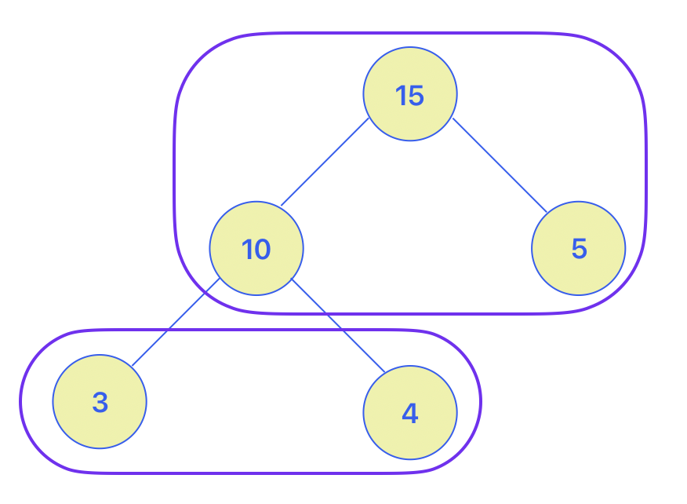
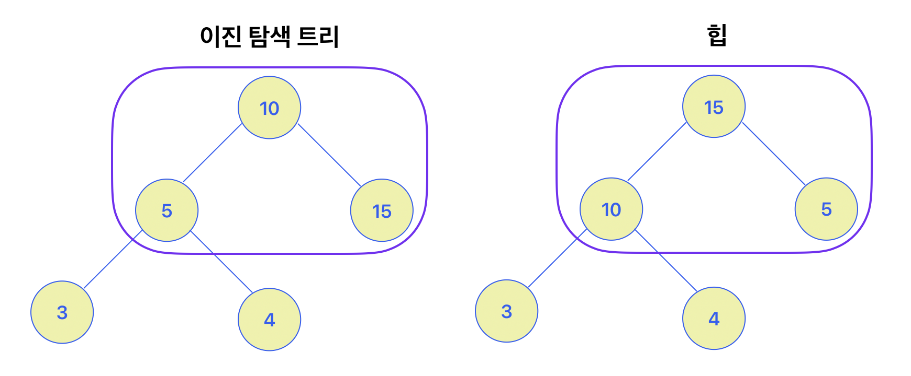
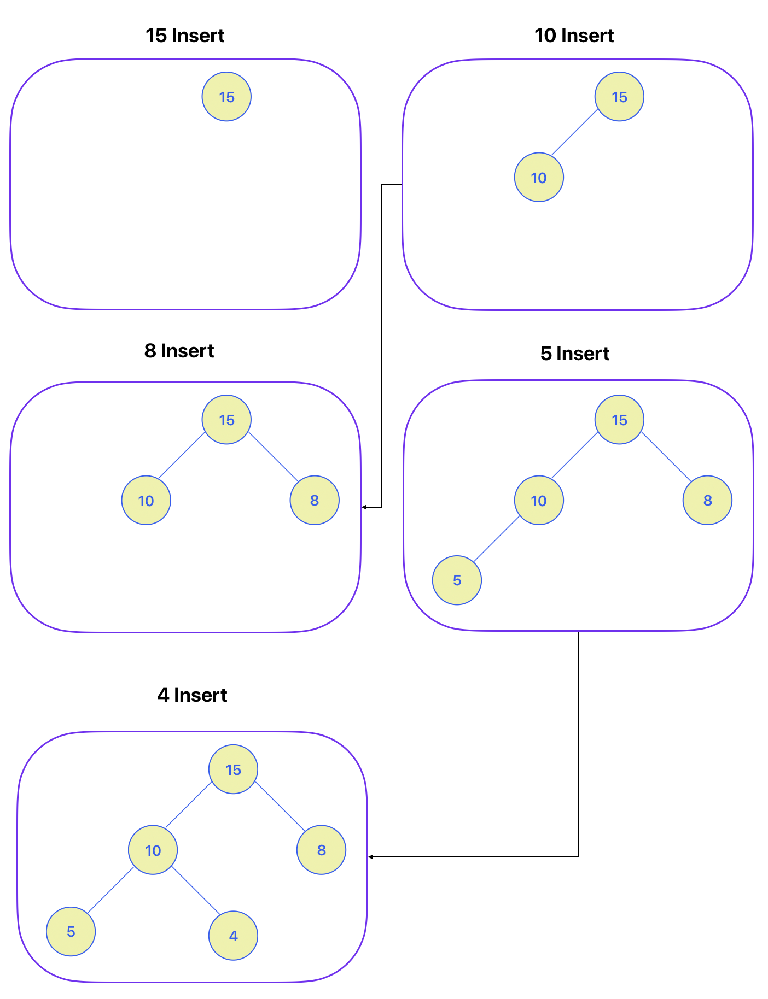
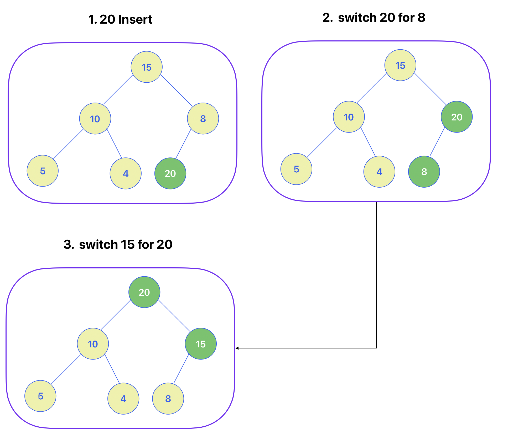
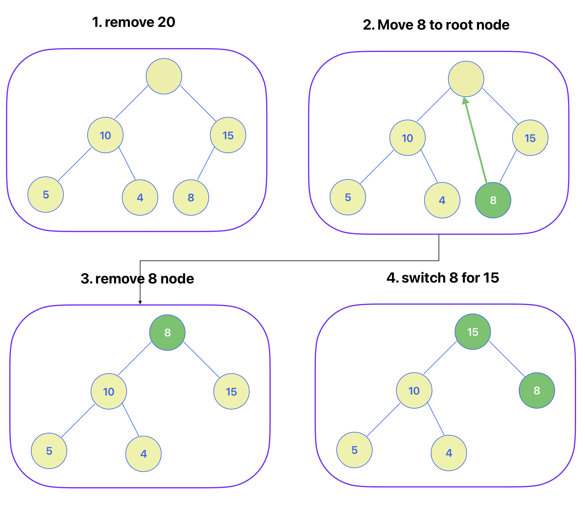
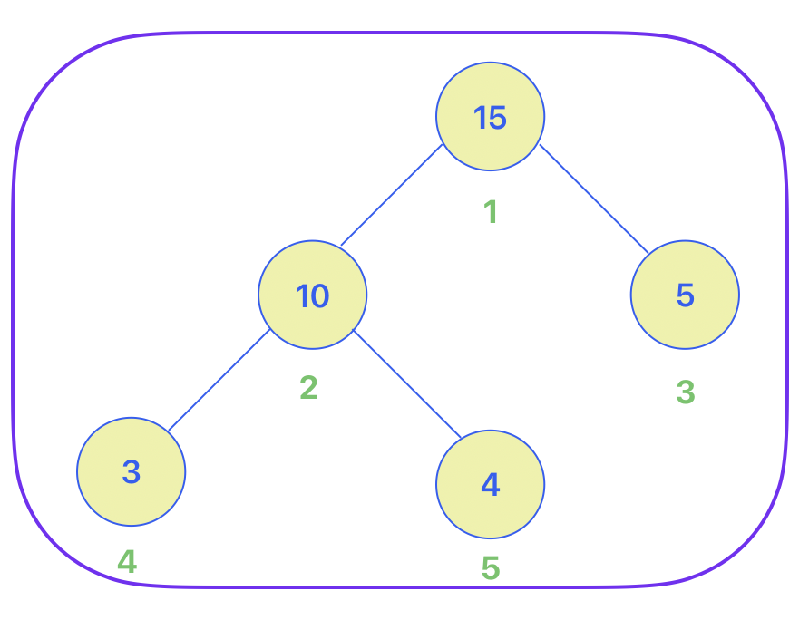

## 🔖 힙(Heap)
힙이란 데이터에서 최대값과 최소값을 빠르게 찾기 위한 `완전 이진 트리(Complete Binary Tree)`이다.
* __완전 이진 트리__: 노드를 삽입할 때 하단 왼쪽부터 차례로 삽입하는 트리


### 사용하는 이유
- `배열`에 데이터를 넣고, `최대값과 최소값을 찾으려면 O(n)`걸리는데, 동일한 배열을 사용하는 `힙`으로 `최대값과 최소값을 찾으면 O(logn)`이 걸린다.
- 즉, 최대값과 최소값을 빠르게 찾아야하는 자료구조 및 알고리즘에 사용된다.

<br>

## 🔖 특징
### 구조
힙은 `최대값`을 구하기 위한 구조와 `최소값`을 구하기 위한 구조로 분류할 수 있다. 
- 최대힙과 최소힙으로 분류된다.

<br>

### 조건
- `각 노드의 값은 해당 노드의 자식 노드가 가진 값보다 크거나 동일`하다.(최대 힙)
- `완전 이진 트리` 형태를 가진다.

<br>

### 힙과 이진 탐색 트리의 공통점
__공통점__
- 힙과 이진 탐색 트리는 모두 이진트리이다.
- `탐색을 위한 구조`

__차이점__
- 힙은 각 노드의 값이 자식 노드보다 크거나 같음
- 이진 탐색 트리는 왼쪽 자식 노드의 값이 가장 작고, 그 다음 부모 노드, 그 다음 오른쪽 자식 노드 값이 가장 큼
- 힙은 이진 탐색 트리의 조건인 자식 노드에서 작은 값은 왼쪽, 큰 값은 오른쪽이라는 조건이 없다.
(힙은 왼쪽 오른쪽 크고작은 구분이 없음)
- `최대/최소 값을 검색하기 위한 구조`


<br>

## 🔖 힙 동작원리
### 힙에 데이터 입력
힙은 완전 이진 트리이므로, 삽입하는 노드는 기본적으로 왼쪽 하단부터 채워진다.



<br>

### 삽입할 데이터가 힙의 데이터 보다 큰 경우 : Max Heap
먼저 삽입된 데이터는 완전 이진 트리 구조에 맞춰 하위 왼쪽 부터 채운다.

채운 노드에서 부모 보다 값이 큰 경우 부모와 위치를 바꿔주는 작업을 진행한다.



<br>

### 힙 데이터 삭제하기 : Max Heap
일반적으로 삭제는 루트노드를 삭제한다.
- 힙의 용도는 최대값과 최소값을 빠르게 찾는 것이기 때문에 루트노드에 놓이 최대값과 최소값을 삭제한다.

상위 노드 삭제시, 가장 하위 왼쪽의 노드를 루트노드로 이동

루트노드가 하위노드보다 작을 경우, 루트노드의 하위노드중 가장 큰 노드와 위치를 변경해준다.



<br>

## 🔖 힙 구현하기
힙은 배열을 이용한 구조를 가지고 있다.

일반적으로 배열은 인덱스가 0부터 시작하지만, 힙의 구현에서는 루트노드의 인덱스 번호를 1부터 시작하게 하기로 하겠다.

__구현에 앞서 알고가야할 지식__
1. 부모 노드 인덱스 번호 = (자식 노드 인덱스 번호 // 2)
2. 왼쪽 하위 노드 인덱스 = (부모 노드 인덱스 번호 * 2)
3. 오른쪽 하위 노드 인덱스 번호 = ((부모 노드 인덱스 번호 *2) + 1)



<br>

### 힙 클래스
1. 구현 1
```python
# 힙
class Heap:
    def __init__(self, data) -> None:
        self.heap_array = []
        self.heap_array.append(data)

heap = Heap(1)
print(heap.heap_array)

'''
[1]
'''
```
힙 객체를 생성하여 data를 인자로 전달했을 때, 배열에 담길 수 있게 Heap 클래스 구현

<br>

2. 삽입 구현


```python
# 힙
class Heap:
    def __init__(self, data) -> None:
        self.heap_array = []
        self.heap_array.append(None)  # 루트노드를 1부터 시작하기 위함 
        self.heap_array.append(data)

    def insert(self, data) -> bool:
        self.heap_array.append(data)
        return True

heap = Heap(1)
print(heap.heap_array)
print(heap.insert(6))
print(heap.heap_array)

'''
[None, 1]
True
[None, 1, 6]
'''
```

3. 삽입 구현 2
- 삽입한 노드가 부모 노드의 값보다 큰 경우, 부모 노드와 삽입한 노드 위치를 변경해야한다.
- 삽입한 노드가 루트노드가 되거나, 부모 노드보다 값이 작거나 같을 경우까지 반복문


```python
# 힙
class Heap:
    def __init__(self, data) -> None:
        self.heap_array = []
        self.heap_array.append(None)  # 루트노드를 1부터 시작하기 위함 
        self.heap_array.append(data)
        
    def insert(self, data) -> bool:
        if len(self.heap_array) == 1:
            self.heap_array.append(data)
            return True
        
        self.heap_array.append(data)
        inserted_index = len(self.heap_array)-1  # 마지막 노드 인덱스

        # 부모가 자식보다 작은 경우 위치 변경
        while self.__move_up(inserted_index):
            parent_index = inserted_index // 2
            self.heap_array[inserted_index], self.heap_array[parent_index]= self.heap_array[parent_index], self.heap_array[inserted_index]
            inserted_index = parent_index  # 부모자리로 변경된 노드가 또 상위 부모노드보다 큰지 비교하기 위한 할당
        return True
    
    def __move_up(self, inserted_index):
        if inserted_index <= 1:
            return False
        
        # 마지막 노드의 부모 인덱스
        # 부모가 더 작으면 True 반환, 부모가 작으면 False 반환
        parent_index = inserted_index // 2  
        if self.heap_array[inserted_index] > self.heap_array[parent_index]:
            return True
        else:
            return False

heap = Heap(15)
heap.insert(10)
heap.insert(8)
heap.insert(5)
heap.insert(4)
heap.insert(20)
heap.heap_array

'''
# 부모와의 비교 알고리즘이 없는 경우
[None, 15, 10, 8, 5, 4, 20]
'''

'''
# 부모와의 비교 알고리즘이 있는 경우
[None, 20, 10, 15, 5, 4, 8]
'''
```

<br>

4. 삭제 구현<br>
삭제는 최상위 노드(루트 노드)를 지워준다.

```python
# 힙
class Heap:
    def __init__(self, data) -> None:
        self.heap_array = []
        self.heap_array.append(None)  # 루트노드를 1부터 시작하기 위함 
        self.heap_array.append(data)

    def pop(self):
        if len(self.heap_array) <= 1:
            return None
        
        returned_data = self.heap_array[1]
        return returned_data

heap = Heap(15)
heap.insert(10)
heap.insert(8)
heap.insert(5)
heap.insert(4)
heap.insert(20)
heap.heap_array

print(heap.pop())

'''
20
'''
```

<br>

5. 삭제 구현 2
-  상단의 데이터 삭제시, 가장 최하위 왼쪽 노드를 루트노드로 이동
- 루트 노드의 값이 하위 노드바다 작을 경우, 루트노드의 하위 노드 중 가장 큰 값을 가진 노드와 루트노드의 위치를 변경해 준다.


```python
# 힙
class Heap:
    def __init__(self, data) -> None:
        self.heap_array = []
        self.heap_array.append(None)  # 루트노드를 1부터 시작하기 위함 
        self.heap_array.append(data)

    def insert(self, data) -> bool:
        if len(self.heap_array) == 1:
            self.heap_array.append(data)
            return True
        
        self.heap_array.append(data)
        inserted_index = len(self.heap_array)-1  # 마지막 노드 인덱스

        # 부모가 자식보다 작은 경우 위치 변경
        while self.__move_up(inserted_index):
            parent_index = inserted_index // 2
            self.heap_array[inserted_index], self.heap_array[parent_index]= self.heap_array[parent_index], self.heap_array[inserted_index]
            inserted_index = parent_index  # 부모자리로 변경된 노드가 또 상위 부모노드보다 큰지 비교하기 위한 할당
        return True
    
    def __move_up(self, inserted_index):
        if inserted_index <= 1:
            return False
        
        # 마지막 노드의 부모 인덱스
        # 부모가 더 작으면 True 반환, 부모가 작으면 False 반환
        parent_index = inserted_index // 2  
        if self.heap_array[inserted_index] > self.heap_array[parent_index]:
            return True
        else:
            return False

    def pop(self):
        if len(self.heap_array) <= 1:
            return None
        
        returned_data = self.heap_array[1]
        self.heap_array[1] = self.heap_array[-1]  # 루트노드에 가장 하위노드 값 할당
        del self.heap_array[-1]  # 할당한 노드의 값은 제거
        popped_index = 1

        while self.__move_down(popped_index):
            left_child_popped_index = popped_index * 2  # 왼쪽 자식노드 index 구하기
            right_child_popped_index = (popped_index * 2) + 1 # 오른쪽 자식노드 index 구하기

            if right_child_popped_index >= len(self.heap_array):
                self.heap_array[popped_index], self.heap_array[left_child_popped_index] = self.heap_array[left_child_popped_index], self.heap_array[popped_index]
                popped_index = left_child_popped_index
            else:
                if self.heap_array[left_child_popped_index] > self.heap_array[right_child_popped_index]:
                    self.heap_array[popped_index], self.heap_array[left_child_popped_index] = self.heap_array[left_child_popped_index], self.heap_array[popped_index]
                    popped_index = left_child_popped_index
                else:
                    self.heap_array[popped_index], self.heap_array[right_child_popped_index] = self.heap_array[right_child_popped_index], self.heap_array[popped_index]
                    popped_index = right_child_popped_index

        return returned_data
    
    def __move_down(self, popped_index):
        left_child_popped_index = popped_index * 2  # 왼쪽 자식노드 index 구하기
        right_child_popped_index = (popped_index * 2) + 1  # 오른쪽 자식노드 index 구하기

        if left_child_popped_index >= len(self.heap_array):
            return False
        elif right_child_popped_index >= len(self.heap_array):
            # 루트노드 보다 왼쪽 하위노드가 더 큰 경우
            if self.heap_array[popped_index] < self.heap_array[left_child_popped_index]:
                return True
            else:
                return False
        else:
            if self.heap_array[left_child_popped_index] > self.heap_array[right_child_popped_index]:
                if self.heap_array[popped_index] < self.heap_array[left_child_popped_index]:
                    return True
                else:
                    return False
            else:
                if self.heap_array[popped_index] < self.heap_array[right_child_popped_index]:
                    return True
                else:
                    return False

heap = Heap(15)
heap.insert(10)
heap.insert(8)
heap.insert(5)
heap.insert(4)
heap.insert(20)
heap.heap_array

print(heap.pop())
heap.heap_array

'''
20
[None, 15, 10, 8, 5, 4]
'''
```

## 🔖 시간복잡도
n개의 노드를 가지는 힙에 데이터를 삽입, 삭제 시 최악의 경우 루트노드에서 리프(leaf)노드까지 비교해야 하므로 트리의 높이(h) = log2n에 가까우므로 O(logn)이다.